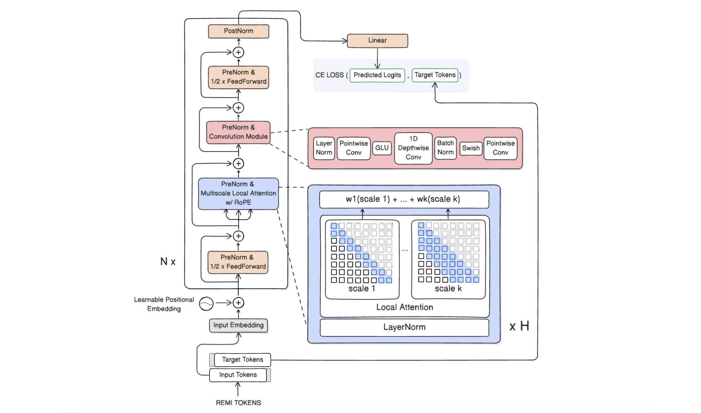

</img>

Conformer with multi-scale local attention for symbolic music generation. See [coma](https://github.com/imbulana/coma) for a similar architecture used for composer classification.

Model Architecture (see [`src/transformer.py`](src/transformer.py)):

- **Embedding**: REMI token embedding + learned positional embedding

- **Decoder**: Stack of conformer-like blocks[^1] (1/2 * FeedForward → Multi-Scale Local Attention → Conformer Conv Module → 1/2 * FeedForward) blocks with hyper-connections and residual streams:
    - **Local Attention**: Multi-scale local self-attention with multiple window sizes (e.g., [32, 64]).
        - Each scale uses windowed attention with optional rotary position embeddings (xpos) or dynamic position bias
        - Scales aggregated via learnable weighted sum
        - Query-Key RMSNorm with learnable scales for improved training stability
    - **Conformer Conv Module**: 
    - LayerNorm → Pointwise conv (1D, expansion factor 2) → GLU activation → Depthwise conv (causal) → Swish → Channel LayerNorm → Pointwise conv → Dropout

    - **Global Attention**: Optional global attention layers can be inserted at specified positions (disabled by default)
    - **Hyper-connections**: Each component wrapped with residual stream expansion/reduction functions

- **Output**: LayerNorm → Linear projection to vocabulary size

## Todo

- [ ] KV caching

## Setup

Create a conda environment with python 3.11

```bash
conda create -n coma-gen python=3.11
conda activate coma-gen
```

Install requirements

```bash
pip install -r requirements.txt
```

## Dataset

Download the Maestro 3.0 dataset[^3]

```bash
wget https://storage.googleapis.com/magentadata/datasets/maestro/v3.0.0/maestro-v3.0.0-midi.zip
unzip 'maestro-v3.0.0-midi.zip'
rm 'maestro-v3.0.0-midi.zip'
mv 'maestro-v3.0.0' 'data/maestro-v3.0.0'
```

## Usage

Adjust training params in [`config.py`](/config.py) and begin training the transformer with

```bash
python3 train.py
```

Tensorboard logs will be saved in the `LOG_DIR` directory.

## References

This repo is largely adapted from the following.

local attention: https://github.com/lucidrains/local-attention

conformer: https://github.com/jreremy/conformer, https://github.com/lucidrains/conformer

miditok: https://github.com/Natooz/MidiTok

[^1]: Gulati, A., Qin, J., Chiu, C., Parmar, N., Zhang, Y., Yu, J., Han, W., Wang, S., Zhang, Z., Wu, Y., & Pang, R. (2020). Conformer: Convolution-augmented Transformer for Speech Recognition. [ArXiv, abs/2005.08100.](https://arxiv.org/abs/2005.08100)

[^2]: Cui XH, Hu P, Huang Z. Music sequence generation and arrangement based on transformer model. Journal of Computational Methods in Sciences and Engineering. 2025;0(0). [doi:10.1177/14727978251337904.](https://doi.org/10.1177/14727978251337904)

[^3]: Hawthorne, C., Stasyuk, A., Roberts, A., Simon, I., Huang, C.A., Dieleman, S., Elsen, E., Engel, J., & Eck, D. (2018). Enabling Factorized Piano Music Modeling and Generation with the MAESTRO Dataset. [ArXiv, abs/1810.12247.](https://arxiv.org/abs/1810.12247)